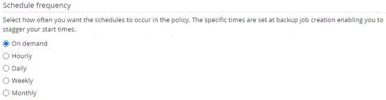

= Crear políticas de backup para bases de datos SAP HANA
:allow-uri-read: 
:icons: font
:imagesdir: ../media/

[role="lead"]
Antes de usar SnapCenter para realizar un backup de los recursos de la base de datos SAP HANA, debe crear una política de backup para el recurso o grupo de recursos que desea incluir en el backup. Una política de backup es un conjunto de reglas que rigen cómo gestionar, programar y retener backups.

*Lo que necesitará*

* Debe tener definida una estrategia de backup.
+
Para obtener más detalles, consulte cómo definir una estrategia de protección de datos para las bases de datos SAP HANA.

* Debe haberse preparado para la protección de datos completando tareas como instalar SnapCenter, añadir hosts, configurar las conexiones del sistema de almacenamiento y añadir recursos.
* El administrador de SnapCenter debe haberle asignado las instancias de SVM de los volúmenes de origen y de destino en caso de que replique copias de Snapshot en un reflejo o almacén.
+
Además, puede definir la configuración de replicación, script y aplicaciones en la política. Estas opciones ahorran tiempo cuando se desea volver a utilizar la política con otro grupo de recursos.

* Pasos*

. En el panel de navegación de la izquierda, haga clic en *Configuración*.
. En la página *Configuración*, haga clic en *Directivas*.
. Haga clic en *Nuevo*.
. En la página *Nombre*, introduzca el nombre y la descripción de la directiva.
. En la página *Configuración*, realice los siguientes pasos:
+
** Elija el tipo de backup:
+
|===
| Si desea... | Realice lo siguiente... 

 a| 
Realice una comprobación de integridad de la base de datos
 a| 
Seleccione *copia de seguridad basada en archivos*. Solo se realiza un backup de los inquilinos activos.

 a| 
Crear un backup mediante la tecnología de copia de Snapshot
 a| 
Seleccione *Snapshot Based*.

|===
** Especifique el tipo de programa seleccionando *a petición*, *hora*, *Diario*, *Semanal* o *Mensual*.
+

NOTE: Puede especificar la programación (fecha de inicio, fecha de finalización y frecuencia) para la operación de backup mientras crea un grupo de recursos. Esto le permite crear grupos de recursos que comparten la misma política y frecuencia de backup, pero también le permite asignar diferentes programaciones de backup a cada política.

+

+

NOTE: Si ha programado para las 2:00 a.m., la programación no se activará durante el horario de verano.

** En la sección *Configuración de copia de seguridad personalizada*, proporcione cualquier configuración de copia de seguridad específica que tenga que pasarse al plugin en formato de clave-valor.
+
Puede pasar varios pares de clave-valor al plugin.

. En la página *Retention*, especifique la configuración de retención para el tipo de copia de seguridad y el tipo de programación seleccionados en la página Tipo de copia de seguridad:
+
|===
| Si desea... | Realice lo siguiente... 

 a| 
Conservar una cierta cantidad de copias de Snapshot
 a| 
Seleccione *total Snapshot copies to keep* y, a continuación, especifique el número de copias Snapshot que desea conservar.

Si la cantidad de copias de Snapshot supera el número especificado, las copias se eliminan empezando por las más antiguas.

NOTE: El valor de retención máximo es 1018 para recursos en ONTAP 9.4 o posterior, y 254 para recursos en ONTAP 9.3 o anterior. Se producirá un error en los backups si la retención se establece en un valor superior a la versión de ONTAP subyacente.

IMPORTANT: Para los backups basados en copias de Snapshot, debe establecer el número de retención en 2 o más si va a habilitar la replicación de SnapVault. Si establece el número de retención en 1, la operación puede generar un error, ya que la primera copia de Snapshot es la de referencia para la relación de SnapVault hasta que se replica una nueva copia de Snapshot en el destino.

 a| 
Conserve las copias de Snapshot por una cierta cantidad de días
 a| 
Seleccione *mantener copias Snapshot para* y, a continuación, especifique el número de días durante los que desea conservar las copias Snapshot antes de eliminarlas.

|===
. Para las copias de seguridad basadas en copias de Snapshot, especifique la configuración de replicación en la página *replicación*:
+
|===
| Para este campo... | Realice lo siguiente... 

 a| 
*Actualizar SnapMirror después de crear una copia Snapshot local*
 a| 
Seleccione este campo para crear copias reflejadas de los conjuntos de backup en otro volumen (replicación de SnapMirror).

Si la relación de protección en ONTAP es del tipo reflejo y almacén y si selecciona solo esta opción, la copia de Snapshot creada en el origen no se transferirá al destino, pero sí aparecerá en el destino. Si esta copia de Snapshot se selecciona desde el destino para realizar una operación de restauración, entonces aparece el mensaje de error Secondary Location is not available for the selected vaulted/mirrored backup.

 a| 
*Actualizar SnapVault después de crear una copia Snapshot local*
 a| 
Seleccione esta opción para realizar una replicación de backup disco a disco (backups de SnapVault).

 a| 
*Etiqueta de política secundaria*
 a| 
Seleccione una etiqueta de Snapshot.

Según la etiqueta de copia de Snapshot que seleccione, ONTAP aplicará la política de retención de copias de Snapshot secundarias que corresponda a esa etiqueta.

NOTE: Si ha seleccionado *Actualizar SnapMirror después de crear una copia Snapshot local*, puede especificar opcionalmente la etiqueta de la directiva secundaria. Sin embargo, si ha seleccionado *Actualizar SnapVault después de crear una copia Snapshot local*, debe especificar la etiqueta de la directiva secundaria.

 a| 
*Número de reintentos de error*
 a| 
Escriba el número máximo de intentos de replicación que se permitirán antes de que la operación se detenga.

|===
+

NOTE: Debe configurar la política de retención de SnapMirror en ONTAP para el almacenamiento secundario a fin de evitar alcanzar el límite máximo de copias de Snapshot en el almacenamiento secundario.

. Revise el resumen y, a continuación, haga clic en *Finalizar*.

